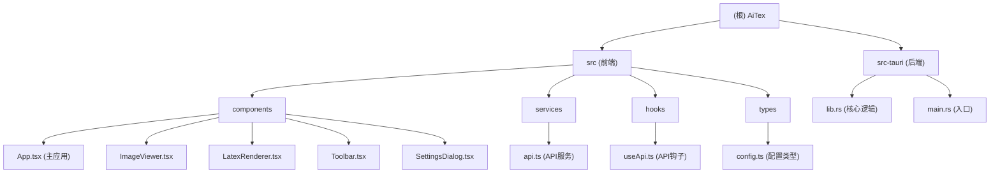

# AiTex - 智能数学公式识别软件

## 变更记录 (Changelog)
- **2025-11-08 21:09:42** - 初始化项目 AI 上下文文档，识别前端 React + 后端 Rust 混合架构

## 项目愿景

AiTex 是一款免费的智能数学公式识别软件，能够将图像中的数学公式转换为可编辑的 LaTeX 格式。采用云端 API 架构，提供轻量快速部署、高精度识别的能力。

## 架构总览

AiTex 采用现代化的桌面应用程序架构：
- **前端**: React + TypeScript + Tailwind CSS 样式系统
- **后端**: Rust + Tauri 框架提供原生系统调用
- **渲染**: KaTeX 库用于 LaTeX 数学公式渲染
- **通信**: Tauri Invoke API 连接前后端
- **配置**: JSON 文件存储用户 API 配置

### 模块结构图



## 模块索引

| 模块路径 | 类型 | 职责 | 技术栈 |
|---------|------|------|--------|
| `src/` | 前端 | React 用户界面和交互 | React 18 + TypeScript + Tailwind CSS |
| `src-tauri/` | 后端 | Rust 核心业务逻辑 | Rust + Tauri 2.0 |

### 前端子模块

| 模块 | 职责 | 关键文件 |
|------|------|----------|
| components | React 组件库 | App.tsx, ImageViewer.tsx, LatexRenderer.tsx, Toolbar.tsx, SettingsDialog.tsx |
| services | API 服务封装 | api.ts |
| hooks | React 自定义钩子 | useApi.ts |
| types | TypeScript 类型定义 | config.ts |

### 后端子模块

| 模块 | 职责 | 关键文件 |
|------|------|----------|
| 核心模块 | 业务逻辑和 API 命令 | lib.rs (包含图像处理、API 调用、配置管理) |
| 入口模块 | 应用程序启动点 | main.rs |

## 运行与开发

### 开发环境要求
- Node.js 18+
- Rust 1.70+
- 系统截图工具（Windows/macOS/Linux）

### 开发命令
```bash
# 安装前端依赖
npm install

# 前端开发模式
npm run dev

# Tauri 开发模式（前端+后端）
npm run tauri:dev

# 构建生产版本
npm run tauri:build
```

### 架构特点
- **跨平台桌面应用**: 使用 Tauri 构建轻量级原生应用
- **云端 API 架构**: 无需本地模型，调用云端多模态大模型
- **现代前端技术**: React + TypeScript 提供类型安全的开发体验
- **响应式布局**: Tailwind CSS 实现自适应界面设计

## 测试策略

### 前端测试
- React 组件单元测试（待补充）
- API 服务集成测试
- 用户交互测试

### 后端测试
- Rust 单元测试（待补充）
- API 集成测试
- 图像处理功能测试

### 端到端测试
- 完整的用户流程测试
- 不同格式图像的识别测试
- API 连接和配置测试

## 编码规范

### TypeScript/JavaScript
- 使用 TypeScript 严格模式（当前关闭，建议启用）
- React 函数组件 + Hooks
- ESLint + Prettier 代码格式化（待配置）

### Rust
- Rust 2021 Edition
- 使用 `cargo clippy` 进行代码检查
- 遵循 Rust API 指导原则

### 通用规范
- 使用有意义的变量和函数命名
- 保持函数简洁，单一职责原则
- 适当的错误处理和用户提示
- 注释复杂业务逻辑

## AI 使用指引

### 核心功能
1. **图像上传与处理**: 支持多种图像格式的上传和预处理
2. **云端 API 调用**: 集成 OpenAI 兼容的多模态 API
3. **LaTeX 渲染**: 使用 KaTeX 实时渲染数学公式
4. **系统截图集成**: 跨平台截图功能
5. **配置管理**: 灵活的 API 配置系统

### 关键算法
- **图像预处理**: 自动检测背景亮度并进行反转处理
- **Base64 编码**: 图像转换为 API 兼容格式
- **LaTeX 清理**: 自动清理 API 响应中的解释性文字
- **配置持久化**: 用户配置的文件系统存储

### 扩展点
- 添加新的 API 提供商支持
- 自定义图像预处理算法
- 扩展 LaTeX 渲染样式
- 添加批量处理功能

## 下一步开发建议

1. **完善测试覆盖**: 添加前端和后端的单元测试和集成测试
2. **代码质量工具**: 配置 ESLint、Prettier、Clippy 等代码质量工具
3. **错误处理增强**: 改进用户友好的错误提示和处理
4. **性能优化**: 图像处理和 API 调用的性能优化
5. **用户体验**: 添加进度指示器、快捷键支持等
6. **文档完善**: 添加详细的 API 文档和用户手册