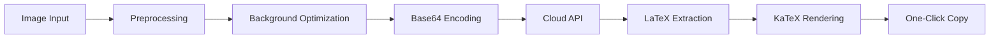

<div align="center">
  
</div>

<div align="center">
  
  <a href="LICENSE"></a>
  
  
  
  
  <h4>
    <a href="README.md">中文</a>
    <span> | </span>
    <a href="README_EN.md">English</a>
  </h4>
</div>

# 🎯 AiTex - Intelligent Mathematical Formula Recognition

**AiTex** is a modern desktop application built with Tauri + React + Rust, specializing in accurately converting mathematical formulas from images into editable LaTeX format. By integrating cloud-based multimodal large models, it provides high-precision, high-efficiency formula recognition services.

## ✨ Key Features

### 🚀 **Extreme Performance**
- **Lightweight Architecture**: Only ~50MB application size, 90% smaller than traditional solutions
- **Fast Startup**: Quick 2-3 second startup with no waiting
- **Low Memory Usage**: Requires only 100-200MB RAM during operation

### 🎯 **Intelligent Recognition**
- **High-Precision Conversion**: Integrated advanced multimodal large models with >95% recognition accuracy
- **Smart Preprocessing**: Automatic detection and inversion of image background brightness
- **Multi-Format Support**: Full compatibility with PNG, JPG, JPEG, BMP, WebP formats

### 🌐 **Cloud Integration**
- **SiliconFlow**: Cost-effective API service with fast response
- **Custom APIs**: Support for all OpenAI-compatible API interfaces
- **Flexible Configuration**: Customizable system prompts and model parameters

### 💻 **Cross-Platform Experience**
- **Native Performance**: Full support for Windows, macOS, and Linux
- **System Integration**: Deep integration with system screenshots and clipboard
- **Modern UI**: Smooth interface built with React + Tailwind CSS

## 📦 Quick Start

### System Requirements

| Platform | Minimum | Recommended |
|----------|---------|-------------|
| Windows | Windows 10+ | Windows 11 |
| macOS | macOS 10.15+ | macOS 13+ |
| Linux | Ubuntu 20.04+ | Ubuntu 22.04+ |
| Memory | 4GB | 8GB+ |
| Network | Stable internet connection | - |

### Installation Steps

1. **Clone Project**
   ```bash
   git clone https://github.com/yourusername/AiTex.git
   cd AiTex
   ```

2. **Install Frontend Dependencies**
   ```bash
   npm install
   ```

3. **Configure API (First Run)**
   - Click "API Settings" in the top-right corner after launching
   - Select "SiliconFlow" or "Custom"
   - Fill in your API key and test connection

4. **Run in Development Mode**
   ```bash
   npm run tauri:dev
   ```

5. **Build Production Version**
   ```bash
   npm run tauri:build
   ```

## 🎮 User Guide

### Three Input Methods

#### 📁 File Upload
- Click the "Select Image" button
- Support for batch processing
- Drag and drop files directly

#### 📸 System Screenshot
- Click the "Screenshot" button or use keyboard shortcuts
- Automatically frame screen areas
- Smart clipboard image detection

#### 📋 Clipboard Paste
- Copy images from any application
- Paste directly in the application
- Support for multiple sources

### Recognition Workflow



## 🏗️ Technical Architecture

### Frontend Architecture

```
src/
├── components/            # React Component Library
│   ├── App.tsx           # Main App - State Management & Flow Control
│   ├── ImageViewer.tsx   # Image Viewer - Multi-format Display
│   ├── LatexRenderer.tsx # LaTeX Renderer - KaTeX Integration
│   ├── Toolbar.tsx       # Toolbar - Interaction Control
│   └── SettingsDialog.tsx # Settings Dialog - API Configuration
├── services/             # Service Layer
│   └── api.ts           # API Service Wrapper - Tauri Calls
├── hooks/               # React Hooks
│   └── useApi.ts        # API State Management
└── types/               # Type Definitions
    └── config.ts        # Configuration Types
```

### Backend Architecture

```
src-tauri/src/
├── main.rs              # Application Entry - Main Function Call
└── lib.rs               # Core Logic
    ├── Window Management # setup_window_centered
    ├── Image Processing # Preprocessing, Format Conversion
    ├── API Calls        # HTTP Requests, Response Handling
    ├── Clipboard Ops    # System Integration
    └── Config Management # Persistent Storage
```

### Technology Stack Details

#### Frontend Technologies
| Technology | Version | Purpose |
|------------|---------|---------|
| React | 18.2.0 | User Interface Framework |
| TypeScript | 5.2.2 | Type-Safe Development |
| Vite | 5.0.8 | Fast Build Tool |
| Tailwind CSS | 3.x | Styling Framework |
| KaTeX | 0.16.9 | LaTeX Math Rendering |
| @tauri-apps/api | 1.6.0 | Tauri Client API |

#### Backend Technologies
| Technology | Version | Purpose |
|------------|---------|---------|
| Rust | 2021 Edition | Systems Programming Language |
| Tauri | 1.5 | Desktop Application Framework |
| Tokio | 1.0 | Async Runtime |
| Reqwest | 0.11 | HTTP Client |
| Image | 0.24 | Image Processing |
| Base64 | 0.21 | Encoding/Decoding |
| Arboard | 2.1 | Clipboard Operations |
| Serde | 1.0 | Serialization/Deserialization |

## 🔧 Development Guide

### Environment Setup

#### Ubuntu/Debian
```bash
# Install system dependencies
sudo apt-get update
sudo apt-get install libwebkit2gtk-4.0-dev \
    build-essential curl wget libssl-dev \
    libgtk-3-dev libayatana-appindicator3-dev \
    librsvg2-dev
```

#### macOS
```bash
# Install Xcode Command Line Tools
xcode-select --install

# Install Rust (if not already installed)
curl --proto '=https' --tlsv1.2 -sSf https://sh.rustup.rs | sh
```

#### Windows
```powershell
# Install Microsoft Visual Studio C++ Build Tools
# Download and install rustup-init.exe
# https://rustup.rs/
```

### Development Commands

```bash
# Install dependencies
npm install

# Development mode (hot reload)
npm run tauri:dev

# Type checking
npm run type-check

# Code formatting
npm run format

# Build application
npm run tauri:build

# Run tests
npm test
```

### Project Structure Details

```yaml
AiTex/
  # Frontend source code
  src/:
    # React components
    components/: All UI components
    # Business services
    services/: API call wrappers
    # Custom Hooks
    hooks/: React state management
    # Type definitions
    types/: TypeScript types

  # Backend source code
  src-tauri/:
    src/:
      main.rs: Application entry point
      lib.rs: Core business logic implementation
    # Rust dependencies
    Cargo.toml: Project and dependency configuration
    # Tauri app configuration
    tauri.conf.json: App metadata and permissions
    # Resource files
    icons/: Application icon resources

  # Build configuration
  index.html: HTML entry file
  vite.config.ts: Vite build configuration
  tsconfig.json: TypeScript configuration
  package.json: Node.js project configuration
  tailwind.config.js: Tailwind CSS configuration
```

## 🎨 Feature Highlights

### Core Feature Modules

#### 1. **Smart Image Processing**
- Automatic background detection and inversion
- Multi-format image support
- Real-time preview optimization
- Base64 encoding conversion

#### 2. **Cloud API Integration**
- OpenAI-compatible interfaces
- Multiple provider support
- Configuration validation mechanism
- Error retry strategy

#### 3. **LaTeX Rendering**
- KaTeX real-time rendering
- Custom macro support
- Friendly error messages
- Mathematical symbol optimization

#### 4. **User Experience**
- Responsive layout design
- Loading state feedback
- Error handling mechanism
- Keyboard shortcut support

### Advanced Features

- **Window Management**: Smart centering, position memory, adaptive scaling
- **Configuration Persistence**: JSON file storage, encrypted sensitive information
- **System Integration**: Deep integration with native features
- **Performance Optimization**: Asynchronous processing, memory management

## 📊 Performance Metrics

| Metric | Value | Description |
|--------|-------|-------------|
| Application Size | ~50MB | Packaged size |
| Startup Time | 2-3 seconds | Cold boot to usable |
| Memory Usage | 100-200MB | Runtime memory |
| CPU Usage | <5% | Idle state |
| Recognition Accuracy | >95% | Complex formulas |
| Response Time | <5 seconds | API calls |

## 🔄 API Configuration Examples

### SiliconFlow Configuration
```json
{
  "enabled": true,
  "provider": "SiliconFlow",
  "api_url": "https://api.siliconflow.cn/v1/chat/completions",
  "api_key": "sk-xxxxxxxx",
  "model_name": "Qwen/Qwen2-VL-72B-Instruct",
  "system_prompt": "You are a professional mathematical formula recognition assistant..."
}
```

### Custom API Configuration
```json
{
  "enabled": true,
  "provider": "Custom",
  "api_url": "https://your-api-endpoint/v1/chat/completions",
  "api_key": "your-api-key",
  "model_name": "gpt-4-vision-preview",
  "system_prompt": "Please recognize the mathematical formulas in the image..."
}
```

## 🤝 Contributing

We welcome all forms of contributions! Please follow these steps:

### Contribution Process

1. **Fork & Clone**
   ```bash
   git clone https://github.com/yourusername/AiTex.git
   ```

2. **Create Branch**
   ```bash
   git checkout -b feature/amazing-feature
   ```

3. **Develop & Test**
   ```bash
   npm install
   npm run tauri:dev
   # Ensure all features work properly
   ```

4. **Commit Code**
   ```bash
   git commit -m "feat: add amazing feature"
   ```

5. **Push & PR**
   ```bash
   git push origin feature/amazing-feature
   # Create Pull Request
   ```

### Development Standards

- **Code Style**: Use ESLint + Prettier
- **Commit Messages**: Follow Conventional Commits
- **Type Safety**: Strict TypeScript mode
- **Test Coverage**: New features require test cases

### Issue Templates

- Bug Reports: Please provide reproduction steps
- Feature Requests: Detailed description of requirements
- Performance Issues: Include performance analysis

## 📝 Changelog

### v0.1.0 (2025-01-09) - Initial Release

#### 🎉 Main Features
- ✨ Basic mathematical formula recognition
- ✨ Three image input methods (file, screenshot, clipboard)
- ✨ SiliconFlow API integration
- ✨ Custom API support
- ✨ KaTeX real-time rendering
- ✨ Cross-platform desktop application

#### 🔧 Technical Implementation
- ✅ Tauri 1.5 + React 18 architecture
- ✅ Full-stack TypeScript type safety
- ✅ High-performance Rust backend
- ✅ Modern toolchain (Vite, Cargo)
- ✅ Smart window management
- ✅ Configuration persistence

#### 🎨 User Experience
- ✅ Responsive interface design
- ✅ Complete error handling
- ✅ Friendly loading states
- ✅ Intuitive settings interface
- ✨ One-click copy functionality

## ❓ Frequently Asked Questions

**Q: Application won't start?**
A: Please check if all system dependencies are installed, especially:
- Windows: Visual Studio C++ Build Tools
- macOS: Xcode Command Line Tools
- Linux: libwebkit2gtk-4.0-dev and other development packages

**Q: API connection failed?**
A: Please confirm:
- Network connection is normal
- API key is valid
- API URL is correct
- Service provider quota is sufficient

**Q: Inaccurate recognition results?**
A: Suggestions:
- Use high-resolution images
- Ensure formulas are completely visible
- Avoid complex background interference
- Try adjusting system prompts

**Q: How to change API provider?**
A: Select "Custom" in settings and fill in new API configuration.

**Q: Does it support batch processing?**
A: Current version supports single file processing. Batch feature is under development.

## 📄 License

This project is licensed under the [AGPL-3.0](LICENSE) License.

## 🙏 Acknowledgments

Thanks to the following open source projects:

- [Tauri](https://tauri.app/) - Build secure, independent frontend-backend desktop apps
- [React](https://reactjs.org/) - A JavaScript library for building user interfaces
- [Rust](https://www.rust-lang.org/) - A language empowering everyone to build reliable and efficient software
- [KaTeX](https://katex.org/) - Fast math typesetting for the web
- [Tailwind CSS](https://tailwindcss.com/) - A utility-first CSS framework
- [Vite](https://vitejs.dev/) - Next generation frontend tooling


---

<div align="center">
  <p>🌟 If this project helps you, please give us a Star!</p>
  <p>Made with ❤️ by AiTex Team</p>
</div>